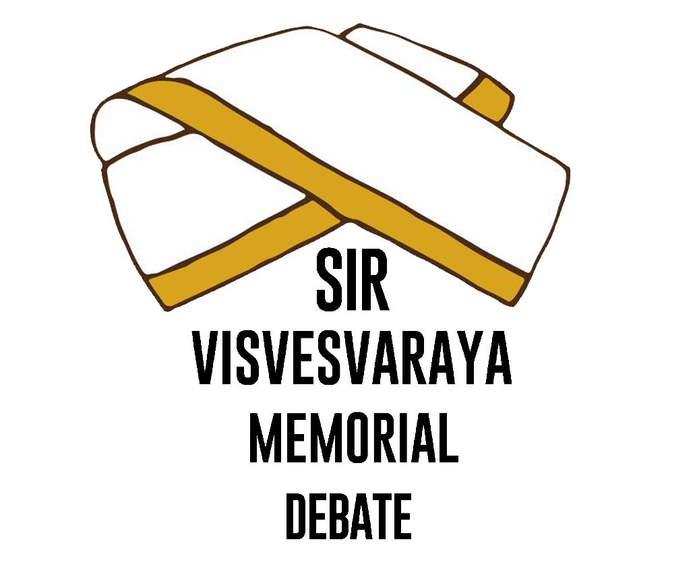
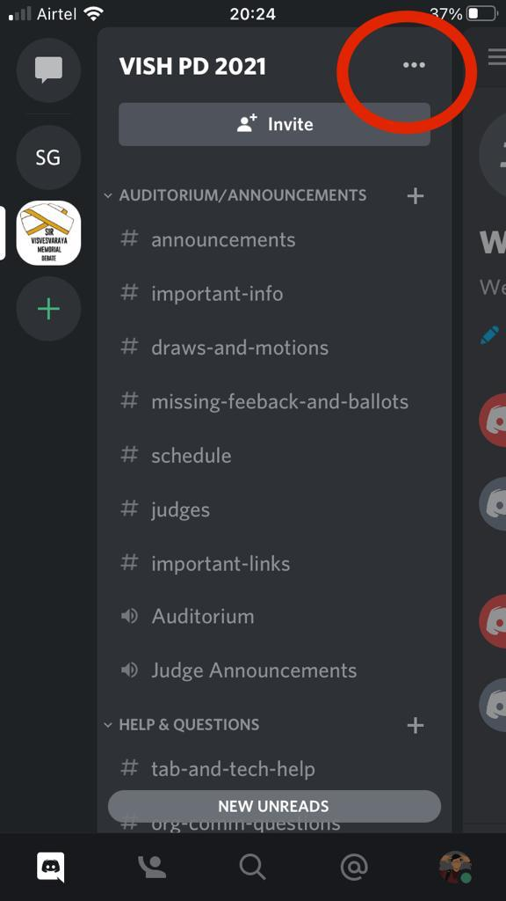
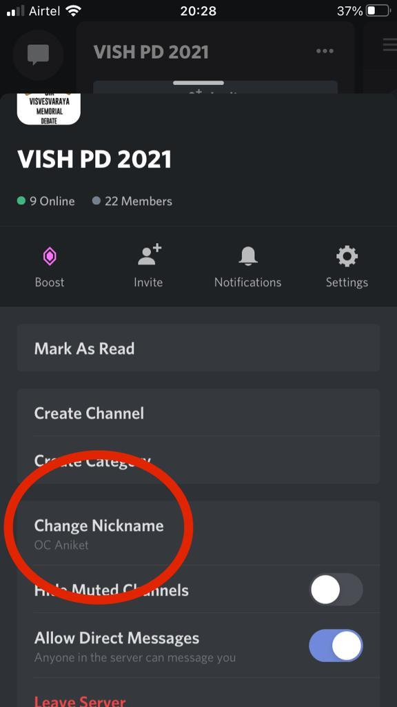
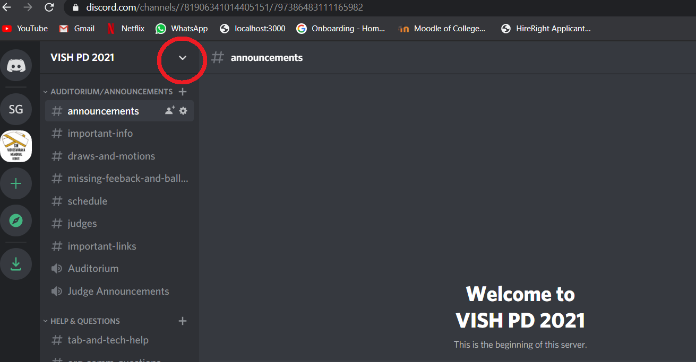
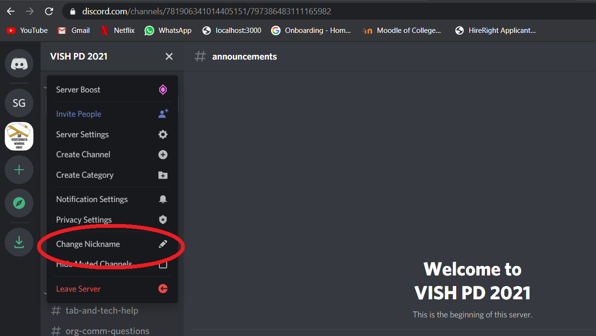
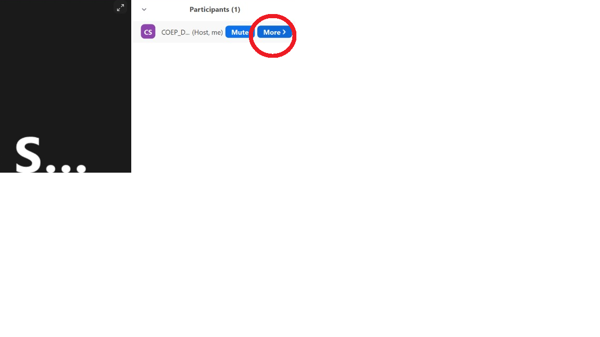
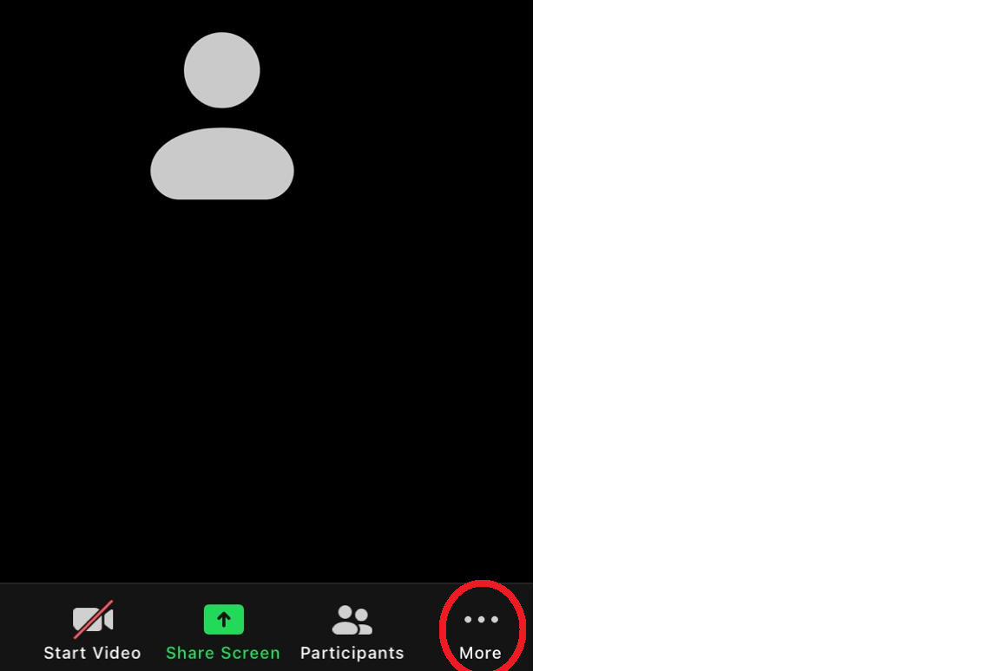
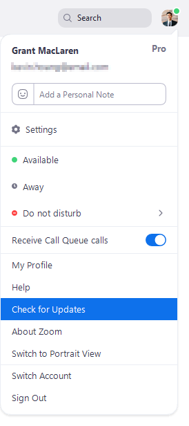
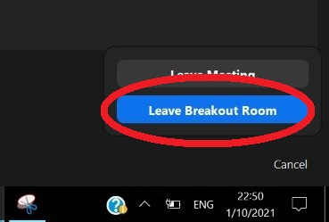

<h1 align="center"> Sir Visvesvaraya Memorial PD 2021 Tech-Guide </h1> <br>
<p align="center">

</p>

<p align="center">
  A comprehensive tech-guide for Sir Visvesvaraya Memorial Parliamentary Debate 2021
</p>


<!-- START doctoc generated TOC please keep comment here to allow auto update -->
<!-- DON'T EDIT THIS SECTION, INSTEAD RE-RUN doctoc TO UPDATE -->
## Table of Contents
- [Table of Contents](#table-of-contents)
- [Introduction](#introduction)
- [Important Links](#important-links)
- [Naming Convention](#naming-convention)
  - [Discord](#discord)
  - [Zoom](#zoom)
- [Zoom](#zoom-1)
  - [Update/Install](#updateinstall)
  - [Renaming yourself](#renaming-yourself)
  - [Breakout Rooms](#breakout-rooms)
- [Discord](#discord-1)
  - [Installation](#installation)
  - [Renaming yourself](#renaming-yourself-1)
  

<!-- END doctoc generated TOC please keep comment here to allow auto update -->

## Introduction
<hr>
The tournament is entirely hosted online. The primary platform for the tournament is Zoom + Discord. Links to the discord server can be found <a href='#important-links'>here</a>

## Important Links
<hr>
A few important links:

* Vish PD Discord Server: <a href="https://discord.gg/bVNSFhcnDH">Link</a>
* Zoom Link for day 1: <a href="#">Link</a>
* Equity Policy: <a href="#">Link</a>

## Naming Convention
<hr>
Participants are requested to follow the naming convention strictly. You will have to rename yourself once on the discord server and everytime when you join a Zoom Meeting.

### Discord
Please rename yourself on discord as: \<role> \<Team Code>(if assigned) \<name>

* For e.g. if you are a Speaker called Shubham with team code as Cherry, rename yourself as 

  ``` 
  S Cherry Shubham
  ```


* For e.g. if you are an adjudicator(Judge) called Rahib, rename yourself as 

  ``` 
  J Rahib
  ```


* For e.g. all members of OC/CA(s) will be named as 

  ``` 
  OC Aniket
  CA Jinit
  ```

* Rename option can be found here on a mobile device:
  * Click on the 3 dots
  
  * 
  
  * Scroll and find the "change nickname" option
  
  * 


* Rename option can be found here on a desktop interface:
  * Click on arrow:
  
  * 
  
  * Scroll and find the "change nickname" option
  
  * 


### Zoom

Please rename yourself on discord as: \<round_name> \<room_name> \<role> \<Name>

* For e.g. 
  * Round 1
  * Room A5
  * Opening Government
  * Shubham


  rename yourself as

  ``` 
  R1 A5 OG Shubham
  ```

* For e.g. 
  * Round 3
  * Room B1
  * Chair
  * Suresh


  rename yourself as

  ``` 
  R3 B1 Chair Suresh
  ```


* For e.g. 
  * Round 2
  * Room A8
  * Closing Opposition
  * Jinit


   rename yourself as

  ``` 
  R2 A8 CO Jinit
  ```

* On PC, click on more and choose rename:
  

* On phones, click on more and choose rename:
  
  

## Zoom
<hr>

All debates will be held on Zoom. Please make sure you have Zoom Client Installed(and logged into) on multiple devices to avoid delays in case of power failure, loss of charge, etc. 

*To be able to use Breakout Rooms feature, ZOOM CLIENT needs to be updated to version 5.3.0 or higher*

### Update/Install
* Clicking on download from the link at https://zoom.us/support/download
  
* 1. Sign in to your zoom desktop client
  1. Click your profile picture
  2. Click on check for updates
   
        


### Renaming yourself

**Rename yourself as soon as you join the server. Rounds will start on given times strictly. Failing to rename yourself might result in you being dropped from the tabs**

Detailed naming convention can be found <a href="#zoom">here</a>.

### Breakout Rooms
* Different rooms will be allocated to participants in the Draws. 
* As soon as you **rename** yourself, you'll be assigned a breakout room.
* Once the debate is over, make sure you **leave the breakout room** and not the meeting.
  


## Discord

<hr>

All communications will happen on Discord App. Ensure you have Discord installed on your phones. It would be helpful if discord is kept open in a browser to ensure smooth experience. 

*Discord will be used as a backup for debates, in case Zoom fails*

### Installation
* Discord can be downloaded for all platforms from https://discord.com/download
* Once downloaded use the link: <a href="https://discord.me">https://discord.me</a> to join the server.

### Renaming yourself

**Rename yourself as soon as you join the server. Rounds will start on given times strictly. Failing to rename yourself might result in you being dropped from the tabs**

Detailed naming convention can be found <a href="#discord">here</a>.
